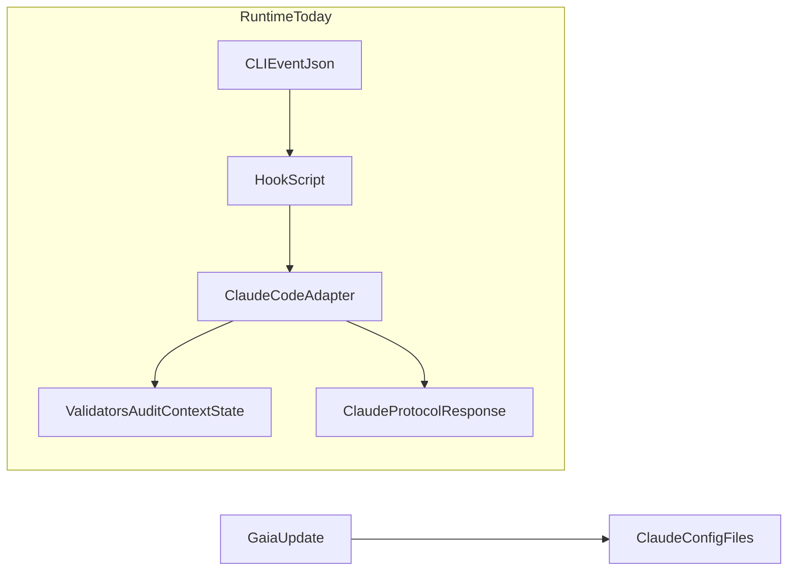
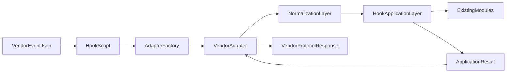
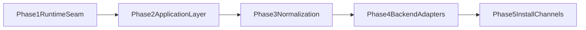

# Gaia CLI Decoupling -- Design Document

**Status:** DESIGN
**Date:** 2026-04-13
**Author:** Cursor

---

## 1. Executive Summary

GAIA is **not fully decoupled from Claude Code today**, but it is **highly
feasible** to open it to multiple coding CLIs with a medium-sized refactor.

The core reason is simple:

- The **shape** of a multi-CLI system already exists: `HookAdapter`,
  normalized types, validators, audit logic, context logic, and tests.
- The **cut** is still wrong: runtime selection, installation, and a large part
  of hook orchestration remain concentrated in `ClaudeCodeAdapter` and in the
  Claude-oriented install flow.

The right first move is **not** to build `CursorAdapter`,
`GeminiCliAdapter`, or `CodexCliAdapter` immediately.

The right first move is to make the **next adapter cheap** by:

1. introducing a runtime adapter factory,
2. extracting shared hook use cases out of `ClaudeCodeAdapter`,
3. adding explicit normalization for tool names, event names, and session
   identity,
4. keeping installation and hook config as a later, channel-specific concern.

Recommended backend priority:

1. **Cursor via Claude compatibility**
2. **Cursor native hooks**
3. **Gemini CLI**
4. **Codex CLI**
5. **Antigravity** as an observer target
6. **OpenCode** as a bridge/plugin target, not a direct hook adapter target

---

## 2. Current Hypothesis

### 2.1 Working Hypothesis

GAIA is already **partially decoupled**:

- shared policies are not fundamentally tied to Claude JSON,
- adapter intent is already represented in code,
- tests already prove that the adapter layer can preserve business behavior.

However, GAIA is **not yet adapter-first in execution**:

- hook entrypoints still choose Claude directly,
- the current Claude adapter also owns too much orchestration,
- the install path still assumes `.claude/` as the primary distribution target.

This leads to the following hypothesis:

> GAIA can support multiple CLI backends without a rewrite, but only after the
> current Claude-specific runtime seam is split into:
> vendor parsing/formatting, shared hook application flow, and existing policy
> modules.

### 2.2 Evidence From The Current Code

| Surface | Current State | Evidence |
|--------|---------------|----------|
| Adapter contract | Good | `hooks/adapters/base.py` already defines `HookAdapter` and normalized result types |
| Hook runtime selection | Coupled | `hooks/modules/core/hook_entry.py` instantiates `ClaudeCodeAdapter()` directly |
| Hook orchestration | Coupled | `hooks/adapters/claude_code.py` mixes parse/format with `adapt_pre_tool_use()`, `_adapt_bash()`, `_adapt_task()`, `adapt_post_tool_use()`, and more |
| Installation channel | Coupled | `package.json` runs `bin/gaia-update.js` on `postinstall`, and that script operates on `.claude/` |
| Hook config naming | Coupled | `hooks/hooks.json` is expressed in Claude hook names and Claude tool names such as `PreToolUse` and `Bash` |
| Behavioral safety | Good | `tests/integration/test_behavioral_equivalence.py` verifies adapter flow and direct validator flow remain identical across many commands |

### 2.3 What Is Already Reusable

These parts already point in the right direction:

- `hooks/adapters/base.py`
- `hooks/adapters/types.py`
- most modules under `hooks/modules/`
- integration and equivalence tests that treat adapter behavior as contract

This is why the problem is a **refactor problem**, not a **rewrite problem**.

---

## 3. Current Coupling Map

### 3.1 Current Runtime Shape



### 3.2 Why This Matters

The current shape is workable for Claude Code, but it makes other backends more
expensive than they should be:

1. `hook_entry.py` does not resolve a backend; it assumes one.
2. `ClaudeCodeAdapter` acts as both:
   - protocol translator, and
   - hook use-case orchestrator.
3. `gaia-update.js` updates `.claude/settings.json` and `.claude/settings.local.json`,
   so install-time behavior is also Claude-first.

### 3.3 Intention Vs Implementation

`ARCHITECTURE.md` already states the intended direction clearly: business logic
should stay CLI-agnostic, and a new backend should primarily mean a new
adapter implementation. The implementation is close to that goal, but not
fully there yet because the current Claude adapter owns too much flow control.

---

## 4. Target Objective

The target is **not** “support every vendor immediately”.

The target is:

> make GAIA cheap to adapt to the next serious CLI without duplicating
> policy logic.

GAIA should be considered “open to multiple CLI backends” when all of the
following are true:

1. Every hook entrypoint resolves its backend through a single adapter factory.
2. Shared hook use cases live outside vendor adapters.
3. Vendor adapters only do:
   - input parsing,
   - normalization,
   - output formatting,
   - vendor-specific exit code semantics.
4. Install/config emission is channel-aware and does not force the shared
   runtime to know about `.claude/`, `.cursor/`, `.gemini/`, or `.codex/`.
5. Backend support is tracked in a matrix:
   - events,
   - tool names,
   - output contract,
   - exit code behavior,
   - unsupported features.

---

## 5. Backend Feasibility

### 5.1 Cursor

**State:** Best first target.

Why:

- Cursor has official hooks documentation and native hook support.
- Cursor also supports **Claude Code third-party hooks**, which creates a low-risk
  validation path before building first-class native support.
- Cursor changelog activity in 2026 shows active investment in hooks, CLI
  controls, rules, and MCP management.

GAIA fit:

- **Very high** via Claude compatibility for early validation.
- **High** for a future `CursorNativeAdapter`.

Main caveat:

- Cursor native naming differs from Claude in important places, such as
  `Shell` vs `Bash`.
- Cursor compatibility docs do not guarantee perfect parity for every Gaia hook
  event, especially edge cases like `TaskCompleted`.

**Recommendation:** first backend to validate, and likely first backend to make
first-class later.

### 5.2 Gemini CLI

**State:** Serious and active backend with a real hooks model.

Why:

- Gemini CLI exposes official hooks, project/user settings, stdin/stdout JSON,
  and event interception around agent, model, and tools.
- Official changelog and release activity through 2026 indicate ongoing
  product investment.

GAIA fit:

- **High**, but it will require a real adapter rather than a thin naming shim.

Main caveat:

- Gemini event taxonomy differs from Claude and Cursor. It includes lifecycle
  points such as `BeforeTool`, `AfterTool`, `BeforeModel`, `AfterModel`, and
  `PreCompress`.

**Recommendation:** second serious native adapter target after Cursor.

### 5.3 Codex CLI

**State:** Real CLI, active product, but hooks are still narrower.

Important clarification:

- Codex is **not only a UI**.
- Official OpenAI docs show Codex as:
  - CLI,
  - desktop app,
  - IDE extension,
  - cloud/web surface.

GAIA fit:

- **Medium**.

Why not higher:

- Codex hooks are officially marked **experimental**.
- Current `PreToolUse` and `PostToolUse` support is largely centered on
  `Bash`.
- Many Gaia-style interception points for `Write`, `Read`, `MCP`, and richer
  tool flows are not yet exposed at the same level.

**Recommendation:** useful target, but only after the shared runtime is clean
enough to support a narrower adapter surface.

### 5.4 Antigravity

**State:** Interesting platform, unclear adapter target.

What looks promising:

- multi-surface agent platform,
- rules and workflow ecosystem,
- active product framing around agents, artifacts, and multi-model execution.

What is missing for GAIA adapter planning:

- a clear, stable, official hook contract equivalent to Cursor, Gemini CLI, or
  Codex CLI.

**Recommendation:** observe, but do not let Antigravity shape the first refactor.

### 5.5 OpenCode

**State:** Useful product, different extensibility model.

Why it differs:

- OpenCode extensibility is more plugin-oriented and JS/TS-centric.
- Its integration model looks more like in-process plugin hooks than
  subprocess JSON hook scripts.

GAIA fit:

- **Low as a direct adapter**.
- **Potentially useful as a bridge** through a plugin or RPC wrapper.

**Recommendation:** do not design the first refactor around OpenCode.

### 5.6 Feasibility Ranking

| Backend | Feasibility | Why |
|--------|-------------|-----|
| Cursor via Claude compatibility | Very high | Lowest-risk validation path and strong product support |
| Cursor native | High | Mature hook model and active investment |
| Gemini CLI | High | Strong hook surface, but clearly a different dialect |
| Codex CLI | Medium | Active and real, but hooks are still experimental and Bash-heavy |
| Antigravity | Medium-low | Interesting ecosystem, weaker hook-contract clarity |
| OpenCode | Low as direct adapter | Better treated as bridge/plugin integration |

---

## 6. Proposed Refactor

### 6.1 Design Principle

Keep the existing policy and validation modules as stable as possible.

Move only the logic that is currently trapped inside `ClaudeCodeAdapter` but
should really belong to a CLI-neutral application layer.

### 6.2 Target Runtime Shape



### 6.3 Main Structural Changes

#### A. Introduce an adapter factory

Create a single resolver such as:

- `hooks/adapters/factory.py`, or
- `hooks/runtime/get_adapter.py`

This should become the only place that knows whether the current backend is:

- `claude`,
- `cursor`,
- `gemini`,
- `codex`,
- or `auto`.

#### B. Extract shared hook application flows

Create a CLI-neutral application layer for the shared cases that already exist:

- pre-tool-use
- post-tool-use
- subagent-start
- subagent-stop
- session-start
- stop
- task-completed

That layer should:

- receive normalized request objects,
- call validators, state writers, context writers, audit code, and policy code,
- return normalized results,
- know nothing about vendor JSON.

#### C. Add explicit normalization

Introduce a small normalization layer for differences such as:

- `Bash` vs `Shell`
- event-name conventions
- session/conversation/turn identifiers
- vendor-specific missing fields or alias fields

#### D. Make `ClaudeCodeAdapter` thin

After extraction, the Claude adapter should mostly do:

- parse stdin JSON,
- map fields to internal request objects,
- call shared application flows,
- format Claude-compatible stdout JSON,
- decide exit codes and Claude-specific response fields.

#### E. Delay install-channel generalization until runtime is clean

Do not start by rebuilding the installer.

First make runtime behavior portable.

Then evolve `gaia-update.js` toward channel-aware config emission.

### 6.4 Target Folder Layout

This is a **target direction**, not a mandatory one-shot rename:

```text
hooks/
  adapters/
    base.py
    types.py
    factory.py
    normalization/
      event_names.py
      tool_names.py
      session_ids.py
    claude_code/
      adapter.py
      parse.py
      format.py
    cursor/
      adapter.py
    gemini_cli/
      adapter.py
    codex_cli/
      adapter.py
  application/
    pre_tool_use.py
    post_tool_use.py
    subagent_start.py
    subagent_stop.py
    session_start.py
    stop.py
    task_completed.py
  modules/
    ... existing domain and policy logic ...
```

### 6.5 Why Keep `hooks/modules/`

There is no need to rename the whole current `hooks/modules/` tree in the first
pass.

That would increase churn without increasing adapter readiness.

A more pragmatic approach is:

- keep `hooks/modules/` as the current business/policy layer,
- add `hooks/application/` above it,
- add `hooks/adapters/` improvements beside it.

This gives the decoupling benefit without forcing a full taxonomy rewrite.

---

## 7. Phases

### 7.1 Phase Flow



### 7.2 Phase 1 -- Runtime Seam

Goal:

- make backend selection real without changing behavior.

Work:

- add adapter factory,
- route `hook_entry.py` through it,
- remove direct `ClaudeCodeAdapter()` construction from shared entry paths where possible.

Success criteria:

- Claude behavior remains unchanged,
- tests still pass,
- runtime is now capable of selecting a backend centrally.

### 7.3 Phase 2 -- Shared Application Layer

Goal:

- extract common hook orchestration out of `ClaudeCodeAdapter`.

Work:

- move shared flow from `adapt_pre_tool_use()`, `_adapt_bash()`,
  `_adapt_task()`, `adapt_post_tool_use()`, `adapt_subagent_stop()`, and
  related orchestration-heavy methods into `hooks/application/`.

Success criteria:

- vendor adapters stop owning policy decisions,
- shared use cases are testable without Claude protocol formatting.

### 7.4 Phase 3 -- Explicit Normalization

Goal:

- make vendor differences visible and local.

Work:

- tool-name aliasing,
- event-name mapping,
- identifier normalization,
- request/response DTO cleanup if needed.

Success criteria:

- differences such as `Shell` vs `Bash` live in one place,
- application flows no longer branch on vendor naming.

### 7.5 Phase 4 -- Backend Adapters

Goal:

- start onboarding supported backends in priority order.

Recommended order:

1. Validate Cursor through Claude compatibility.
2. Add `CursorNativeAdapter` if first-class support is needed.
3. Add `GeminiCliAdapter`.
4. Add `CodexCliAdapter` with explicit scope limits if Codex hooks remain narrower.

Success criteria:

- each backend documents supported events and unsupported gaps,
- shared application flows remain unchanged.

### 7.6 Phase 5 -- Install Channels

Goal:

- stop assuming `.claude/` as the only install/config target.

Work:

- separate runtime portability from install portability,
- introduce channel-aware config emitters later,
- support `.claude/`, `.cursor/`, `.gemini/`, `.codex/` only after runtime is stable.

Success criteria:

- installer no longer hardcodes Claude as the only operational channel.

---

## 8. Risks And Open Questions

1. Cursor Claude-compatibility may be enough for part of the workflow, but not
   for every Gaia event such as `TaskCompleted`.
2. Gemini CLI may expose hook opportunities above the current Gaia contract
   such as model-level events. Decide later whether Gaia wants to support those
   or intentionally stay hook-minimal.
3. Codex CLI hook scope may remain narrower for some time, which could make its
   adapter intentionally partial.
4. A full rename of `hooks/modules/` into a new taxonomy is probably not worth
   the churn in the first pass.
5. Install-channel abstraction should not start before runtime abstraction is
   stable, or the project risks solving packaging before solving architecture.

---

## 9. References

### Internal

- `ARCHITECTURE.md`
- `hooks/adapters/base.py`
- `hooks/adapters/claude_code.py`
- `hooks/modules/core/hook_entry.py`
- `hooks/hooks.json`
- `package.json`
- `bin/gaia-update.js`
- `tests/integration/test_behavioral_equivalence.py`

### External

- [Cursor Hooks](https://cursor.com/docs/agent/hooks)
- [Cursor Third-Party Hooks](https://cursor.com/docs/reference/third-party-hooks)
- [Cursor CLI Changelog, Jan 8 2026](https://cursor.com/changelog/cli-jan-08-2026)
- [Gemini CLI Hooks](https://www.geminicli.com/docs/hooks/)
- [Gemini CLI Latest Changelog](https://geminicli.com/docs/changelogs/latest/)
- [Codex Quickstart](https://developers.openai.com/codex/quickstart/?setup=cli)
- [Codex CLI Reference](https://developers.openai.com/codex/cli/reference/)
- [Codex Hooks](https://developers.openai.com/codex/hooks/)
- [Codex Changelog](https://developers.openai.com/codex/changelog/)
- [Antigravity Documentation](https://antigravity.im/documentation)
- [OpenCode Plugins](https://opencode.ai/docs/plugins/)
